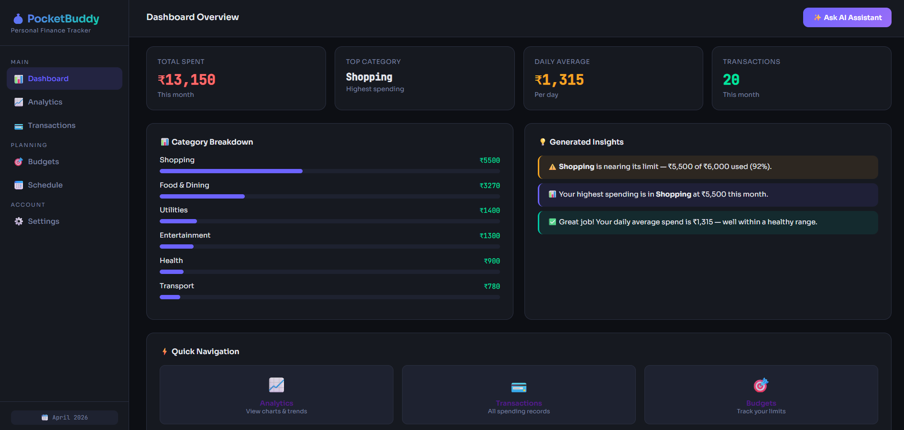
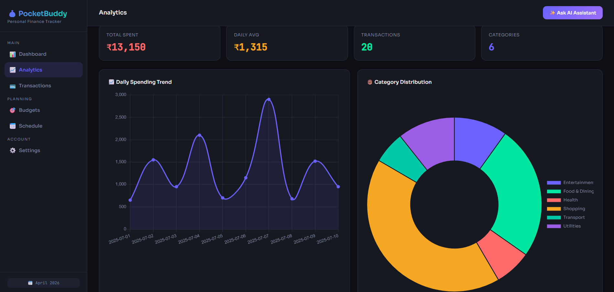
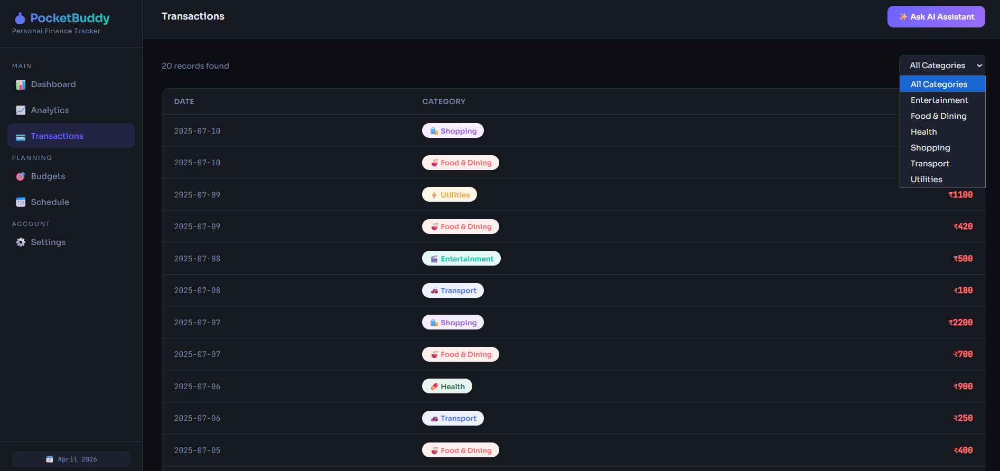
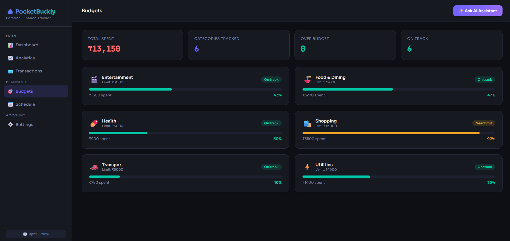
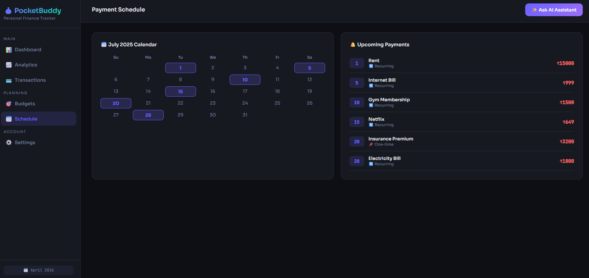
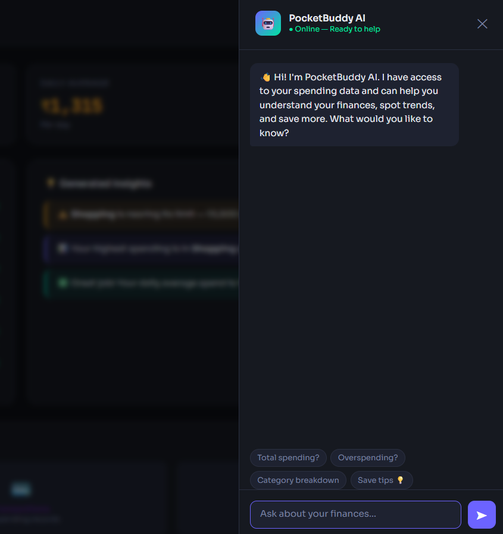

# 💸 PocketBuddy

> **Your AI-powered personal finance tracker — know your daily spending limit, understand your habits, and ask your money questions out loud.**

---

## 🧩 Problem Statement

Most students and young professionals know their monthly income, but have no reliable way to answer a deceptively simple question: *"How much can I actually spend today?"*

Fixed expenses like rent, subscriptions, and EMIs silently consume a large portion of income before the month even begins. Without accounting for these upfront, day-to-day spending decisions are made blind — leading to overspending, end-of-month stress, and no clear picture of where money actually went.

Existing budgeting apps are either too complex, require manual categorization across multiple views, or lack the contextual intelligence to answer follow-up questions about your own financial data.

---

## ✅ Solution Overview

PocketBuddy is a Flask-based web application that solves this by combining three things:

1. **Smart daily budget calculation** — subtracts recurring fixed expenses from monthly income and divides the remainder by days remaining in the month to give you a real, actionable daily allowance.
2. **Spending analytics with automated insights** — ingests your expense CSV and surfaces typed insights (warnings, tips, anomalies) derived from your actual spending patterns using Pandas.
3. **An AI financial assistant** — a chat interface backed by the Google Gemini API that is context-aware of your spending data, allowing you to ask natural language questions about your finances.

---

## ✨ Key Features

- **Guilt-free daily budget calculator** — computes how much you can spend today after accounting for recurring expenses and days left in the month
- **Automated spending insights** — the `insight_service` flags overspending warnings, category trends, and budget health in real time
- **Category-level budget tracking** — per-category limits with live progress bars and "On track / Near limit / Over budget" status badges
- **Recurring expense & payment schedule** — calendar view of upcoming payments with recurring vs. one-time tagging
- **Transaction log with category filter** — full spending history with color-coded category chips
- **AI financial chatbot** — conversational assistant powered by the Google Gemini API, context-aware of your spending data, with quick-action prompts ("Total spending?", "Overspending?", "Save tips 💡")
- **Graceful AI fallback** — rule-based smart chatbot activates automatically when no API key is configured
- **Zero-config data directory** — `data/` is auto-created at startup; no database setup required

---

## 🤖 AI Integration

PocketBuddy's AI layer is designed to be context-aware and resilient.

### How it works

The chatbot is exposed via the `/api` blueprint (`routes/chat_routes.py`) and powered by the **Google Gemini API** (`anthropic>=0.40.0`). Rather than sending a generic prompt, the assistant is passed financial context — spending totals, category breakdowns, and budget status — so its responses are grounded in the user's actual data, not generic financial advice.

The chat panel (accessible from any page via the **"Ask AI Assistant"** button) opens as a side drawer and includes quick-prompt chips so users can get instant answers without typing:

> *"Total spending?"* · *"Overspending?"* · *"Category breakdown"* · *"Save tips 💡"*

### API key detection and fallback

At startup, `app.py` checks for the `GOOGLE_API_KEY` environment variable:

```python
api_key = os.environ.get("GOOGLE_API_KEY", "")
if api_key:
    print("[PocketBuddy] GOOGLE_API_KEY found — AI chatbot active")
else:
    print("[PocketBuddy] No GOOGLE_API_KEY — using smart fallback chatbot")
```

If no key is present, the app activates a **smart rule-based fallback chatbot** — the application remains fully functional without requiring any API configuration.

### Context awareness

The chatbot receives spending summaries generated by `services/insight_service.py` as part of its prompt context, allowing it to answer questions like:
- *"Am I overspending on food this month?"*
- *"How much have I spent on transport this week?"*
- *"What's my remaining daily budget?"*

---

## 🛠️ Tech Stack

| Layer | Technology |
|---|---|
| **Backend** | Python 3.10+, Flask 3.x (application factory pattern) |
| **AI** | Anthropic API (`claude-*` models), rule-based fallback |
| **Data Processing** | Pandas 2.x — CSV ingestion, aggregation, insight generation |
| **Frontend** | HTML5 + Jinja2 templates (62.8% of codebase) |
| **Charts** | Daily spending trend line chart, category donut chart |
| **Persistence** | CSV files (spending data), JSON (recurring expenses) |
| **Configuration** | python-dotenv — `.env` file support |
| **Testing** | Pure Python smoke test (`test_insights.py`) |

---

## 🗂️ Architecture & Folder Structure

```
PocketBuddy/
│
├── app.py                      # Application factory (create_app), blueprint registration
│
├── routes/
│   ├── main_routes.py          # Page routes: dashboard, analytics, transactions, budgets, schedule
│   └── chat_routes.py          # /api prefix — chatbot endpoint, Anthropic integration
│
├── services/
│   └── insight_service.py      # Core logic: get_summary() — Pandas analytics + typed insights
│
├── templates/                  # Jinja2 HTML templates (all 6 views + chatbot drawer)
│
├── data/
│   └── daily_spending.csv      # Flat-file spending store (auto-created on first run)
│
├── recurring_expenses.json     # Persistent store for fixed monthly expenses + payment schedule
│
├── test_insights.py            # Standalone smoke test for insight_service.get_summary()
├── requirements.txt
└── .env                        # Local secrets (not committed)
```

### Separation of concerns

- **`app.py`** handles only wiring: factory setup, config, blueprint registration, and `.env` loading. No business logic lives here.
- **`routes/`** handles HTTP concerns — request parsing and response rendering. Routes delegate all computation to services.
- **`services/`** is the analytical core. `insight_service.get_summary()` is independently testable and has no Flask dependency.
- **`templates/`** is pure presentation. Jinja2 templates receive pre-computed context from routes — no logic in templates.
- **`data/`** and `recurring_expenses.json` serve as a lightweight persistence layer, keeping the stack dependency-free (no database required).

---

## 📸 Screenshots

### Dashboard — Spending Overview & AI Insights


---

### Analytics — Daily Trend & Category Distribution


---

### Transactions — Full Spending History with Category Filter


---

### Budgets — Per-Category Limit Tracker


---

### Schedule — Payment Calendar & Upcoming Bills


---

### AI Chatbot — Context-Aware Financial Assistant


---

## ⚙️ Installation & Setup

### Prerequisites

- Python 3.10 or higher
- pip

### 1. Clone the repository

```bash
git clone https://github.com/Manaspaliwal18/PocketBuddy.git
cd PocketBuddy
```

### 2. Create and activate a virtual environment

```bash
# macOS / Linux
python3 -m venv venv
source venv/bin/activate

# Windows
python -m venv venv
venv\Scripts\activate
```

### 3. Install dependencies

```bash
pip install -r requirements.txt
```

### 4. Configure environment variables

```bash
cp .env.example .env   # or create .env manually
```

Edit `.env` with your values (see [Environment Variables](#-environment-variables) below).

### 5. Run the application

```bash
python app.py
```

The app will be available at `http://127.0.0.1:5000`.

> **Note:** The `data/` directory and `daily_spending.csv` are created automatically on first run. No database migration is needed.

---

## 🔐 Environment Variables

Create a `.env` file in the project root:

```env
# Required for AI chatbot (optional — app runs with fallback if absent)
GOOGLE_API_KEY=your_google_api_key_here
# Flask secret key (change this in production)
SECRET_KEY=your-strong-secret-key-here```

| Variable | Required | Description |
|---|---|---|
| `ANTHROPIC_API_KEY` | Optional | Enables the AI-powered chatbot. Without it, the rule-based fallback activates automatically. |
| `SECRET_KEY` | Recommended | Flask session secret. Defaults to `dev-secret-key` if not set — change for any deployment. |

> ⚠️ Never commit your `.env` file. It is already included in `.gitignore`.

---

## 🚀 Usage

### Typical user flow

**1. Set up your budget**
Navigate to **Budgets** → set per-category monthly limits (e.g., Shopping: ₹6,000, Food & Dining: ₹7,000). Navigate to **Schedule** → add recurring expenses (rent, subscriptions, bills) with their due dates.

**2. Log daily spending**
Add expenses with an amount and category. Entries are appended to `data/daily_spending.csv`.

**3. View your dashboard**
The Dashboard shows total spent, top category, daily average, and transaction count. The **Category Breakdown** panel shows progress bars per category. The **AI Insights** panel surfaces real-time typed alerts:
- ⚠️ `WARNING` — budget limit approaching (e.g., "Shopping is nearing its limit — ₹5,500 of ₹6,000 used (92%)")
- 📊 `INFO` — spending pattern observations
- ✅ tip — positive reinforcement when on track

**4. Explore analytics**
The Analytics page shows a **Daily Spending Trend** line chart and a **Category Distribution** donut chart across all tracked categories.

**5. Review transactions**
The Transactions page lists all records with date, color-coded category chip, and amount. Filter by category using the dropdown.

**6. Check your schedule**
The Schedule page shows a monthly calendar with payment due dates highlighted, alongside an Upcoming Payments list showing recurring vs. one-time tags.

**7. Ask the AI assistant**
Click **"Ask AI Assistant"** from any page. The chat panel opens as a side drawer. Use quick-prompt chips or type a free-form question about your finances.

### Running the insight smoke test

```bash
python test_insights.py
```

This validates that `insight_service.get_summary()` correctly processes `data/daily_spending.csv` without starting the Flask server.

**Expected CSV format for `data/daily_spending.csv`:**

```
date,amount,category
2025-07-01,680,Shopping
2025-07-01,350,Food & Dining
2025-07-02,1180,Utilities
```

---

## 🔮 Future Improvements

- **User authentication** — multi-user support with Flask-Login or JWT so each user has isolated spending data
- **Database backend** — replace CSV/JSON persistence with SQLite or PostgreSQL for concurrent writes and query performance at scale
- **Multi-month trend analysis** — extend `insight_service` to compare spending patterns across months, not just the current month
- **Export to PDF/CSV** — allow users to download their monthly spending reports
- **Budget alerts via email/SMS** — trigger notifications when a category approaches or exceeds its limit
- **Mobile-responsive UI** — optimize templates and charts for small screens
- **Recurring expense auto-detection** — use Pandas to identify statistically regular spending patterns and suggest them as recurring entries

---

## 📄 License

This project is open source. See the [LICENSE](LICENSE) file for details.

---

<p align="center">Built by <a href="https://github.com/Manaspaliwal18">Manas Paliwal</a></p>
